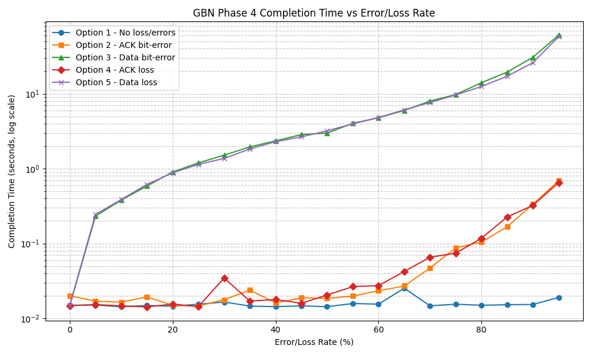
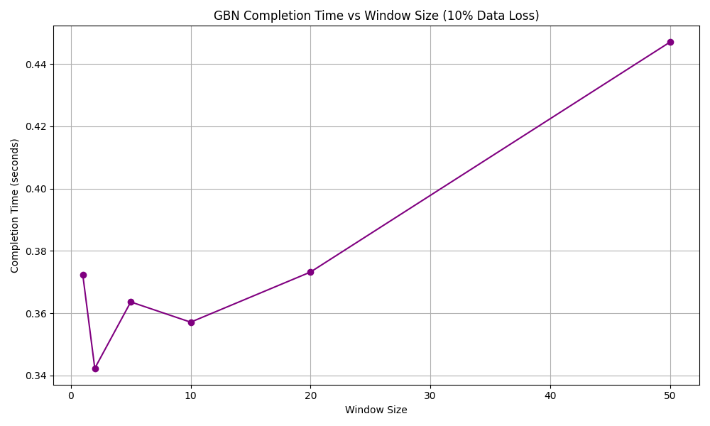
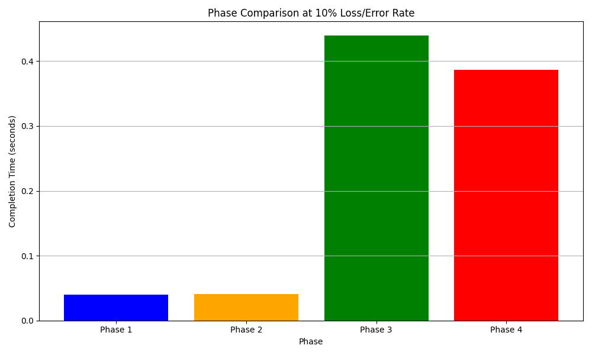

# Reliable Transport over UDP
Built for EECE 4830 Network Design at UMass Lowell

## Overview
UDP sends data fast but makes no promises: packets can arrive corrupted, arrive out of order, or never arrive at all, and the sender is never told. This project builds reliability on top of it from scratch, one mechanism at a time.

Phase 1 (RDT 1.0) assumes a perfect channel and does a plain file transfer.
Phase 2 (RDT 2.2) adds checksums to catch corrupted packets and sequence numbers so the receiver can tell a retransmission from new data.
Phase 3 (RDT 3.0) adds a countdown timer, so the sender resends when an acknowledgment never comes back.
Phase 4 (Go-Back-N) sends multiple packets at once using a sliding window instead of waiting for each acknowledgment, which is far faster on a clean channel.

Together these are the same problems TCP solves, implemented by hand to see how each mechanism earns its place.

## Team
| Name | Email |
|---|---|
| Sinjini Bhattacharjee | sinjini.bx@gmail.com |

## Demo Video
- Phase 1: https://youtu.be/8d3UtI3cKqU
- Phase 2: https://youtu.be/JzjmPTGw_FM
- Phase 3: https://youtu.be/_TLSPXBfdpM
- Phase 4: https://youtu.be/Q9Q3QGNUzAw

---

## Repo Structure

src/               - all Python source files
scripts/           - experiment runner and plot script
docs/              - design documents
data/              - input files
results/           - output files, CSV data, plots
README.md
contribution.txt

---

## Requirements
- Python 3.x
- matplotlib for plots: pip install matplotlib
- No other external libraries needed

---

## Phase 1 - How to Run

### Phase 1a - UDP Echo

Terminal 1:
python src/udp_server.py

Terminal 2:
python src/udp_client.py

### Phase 1b - RDT 1.0 File Transfer

Terminal 1:
python src/receiver.py --port 9000 --out results/received.bmp

Terminal 2:
python src/sender.py --host 127.0.0.1 --port 9000 --file data/480-360-sample.bmp

---

## Phase 2 - How to Run

### Option 1: No errors

Terminal 1:
python src/receiver.py --port 9000 --out results/received.bmp --data-error-rate 0

Terminal 2:
python src/sender.py --host 127.0.0.1 --port 9000 --file data/480-360-sample.bmp --ack-error-rate 0

### Option 2: ACK bit-errors

Terminal 1:
python src/receiver.py --port 9000 --out results/received.bmp --data-error-rate 0

Terminal 2:
python src/sender.py --host 127.0.0.1 --port 9000 --file data/480-360-sample.bmp --ack-error-rate 0.3

### Option 3: Data bit-errors

Terminal 1:
python src/receiver.py --port 9000 --out results/received.bmp --data-error-rate 0.3

Terminal 2:
python src/sender.py --host 127.0.0.1 --port 9000 --file data/480-360-sample.bmp --ack-error-rate 0

---

## Phase 3 - How to Run

### Option 1: No loss and no bit-errors

Terminal 1:
python src/receiver.py --port 9000 --out results/received.bmp

Terminal 2:
python src/sender.py --host 127.0.0.1 --port 9000 --file data/480-360-sample.bmp

### Option 2: ACK bit-errors (30% error rate)

Terminal 1:
python src/receiver.py --port 9000 --out results/received.bmp

Terminal 2:
python src/sender.py --host 127.0.0.1 --port 9000 --file data/480-360-sample.bmp --ack-error-rate 0.3

### Option 3: Data bit-errors (30% error rate)

Terminal 1:
python src/receiver.py --port 9000 --out results/received.bmp --data-error-rate 0.3

Terminal 2:
python src/sender.py --host 127.0.0.1 --port 9000 --file data/480-360-sample.bmp

### Option 4: ACK packet loss (30% loss rate)

Terminal 1:
python src/receiver.py --port 9000 --out results/received.bmp

Terminal 2:
python src/sender.py --host 127.0.0.1 --port 9000 --file data/480-360-sample.bmp --ack-loss-rate 0.3

### Option 5: Data packet loss (30% loss rate)

Terminal 1:
python src/receiver.py --port 9000 --out results/received.bmp --data-loss-rate 0.3

Terminal 2:
python src/sender.py --host 127.0.0.1 --port 9000 --file data/480-360-sample.bmp

---

## Phase 4 - How to Run

### Option 1: No loss and no bit-errors

Terminal 1:
python src/receiver.py --port 9000 --out results/received.bmp

Terminal 2:
python src/sender.py --host 127.0.0.1 --port 9000 --file data/480-360-sample.bmp --window-size 10

### Option 2: ACK bit-errors (30% error rate)

Terminal 1:
python src/receiver.py --port 9000 --out results/received.bmp

Terminal 2:
python src/sender.py --host 127.0.0.1 --port 9000 --file data/480-360-sample.bmp --window-size 10 --ack-error-rate 0.3

### Option 3: Data bit-errors (30% error rate)

Terminal 1:
python src/receiver.py --port 9000 --out results/received.bmp --data-error-rate 0.3

Terminal 2:
python src/sender.py --host 127.0.0.1 --port 9000 --file data/480-360-sample.bmp --window-size 10

### Option 4: ACK packet loss (30% loss rate)

Terminal 1:
python src/receiver.py --port 9000 --out results/received.bmp

Terminal 2:
python src/sender.py --host 127.0.0.1 --port 9000 --file data/480-360-sample.bmp --window-size 10 --ack-loss-rate 0.3

### Option 5: Data packet loss (30% loss rate)

Terminal 1:
python src/receiver.py --port 9000 --out results/received.bmp --data-loss-rate 0.3

Terminal 2:
python src/sender.py --host 127.0.0.1 --port 9000 --file data/480-360-sample.bmp --window-size 10

### Verify file integrity
md5 data/480-360-sample.bmp
md5 results/received.bmp

---

## Reproducing the Performance Plots

Step 1 - Run experiments:
python scripts/run_experiments.py

This generates results/phase4_times.csv, results/phase4_window.csv

Step 2 - Generate plots:
python scripts/plot_results.py

This generates results/phase4_chart1.png, results/phase4_chart2.png, results/phase4_chart3.png

---
## Results

Data path impairments cost roughly three orders of magnitude more than ACK path impairments at the same rate. At a 60% rate, data loss and data bit errors push completion time to about 6 seconds, while ACK loss and ACK bit errors stay under 0.05 seconds.

Go-Back-N uses cumulative acknowledgments, so a lost ACK is usually covered by the next one to arrive. A corrupted or lost data packet has no such fallback: the receiver discards everything after it and the sender retransmits the full window.

Data bit errors and data loss track almost identically, since a failed checksum and a missing packet are equivalent from the receiver's perspective.

## Known Limitations
- GBN handles bit errors and packet loss with pipelining
- At very high loss rates, the entire window gets retransmitted repeatedly which is slow
- Selective Repeat is added in Phase 5
